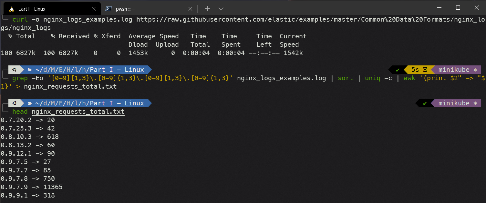

# Parte I: Ejercicios Linux

1. Comandos para obtener los logs de nginx y ordenar la direcciones ip.

```
curl -o nginx_logs_examples.log https://raw.githubusercontent.com/elastic/examples/master/Common%20Data%20Formats/nginx_logs/nginx_logs

grep -Eo '[0-9]{1,3}\.[0-9]{1,3}\.[0-9]{1,3}\.[0-9]{1,3}' nginx_logs_examples.log | sort | uniq -c | awk '{print $2" -> "$1}' > nginx_requests_total.txt
```



2. El script crear el directorio si este no existe, después ejecuta el comando anterior. Por último, si es el día 7 de la semana, crea un tar.gz con todos los archivos de los últimos 7 días que existan.

3. `crontab` con las siguientes especificaciones: En el minuto 59, a las 23 horas, todos los días del mes, todos los meses y todos los días de la semana.

```
crontab -e

59 23 * * * /home/lester/nginx_logs-script.sh
```
