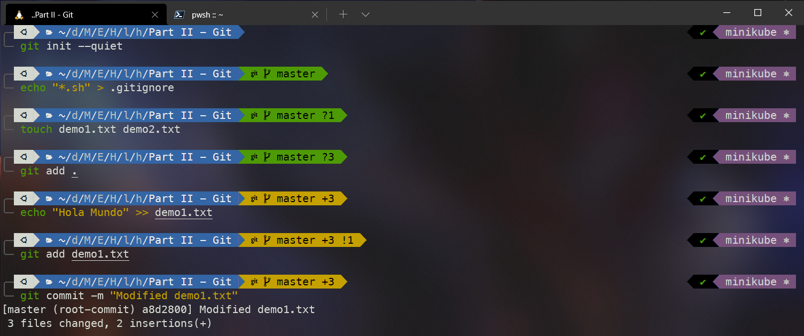
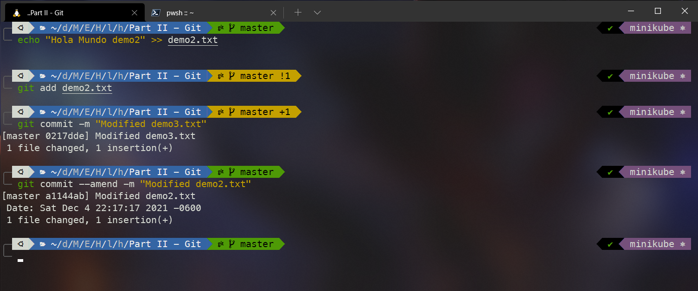
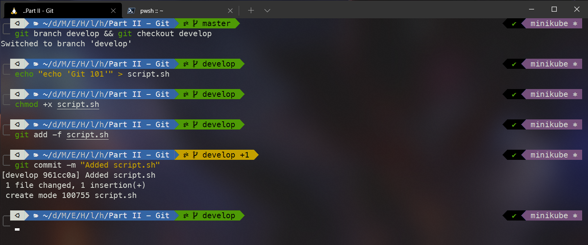
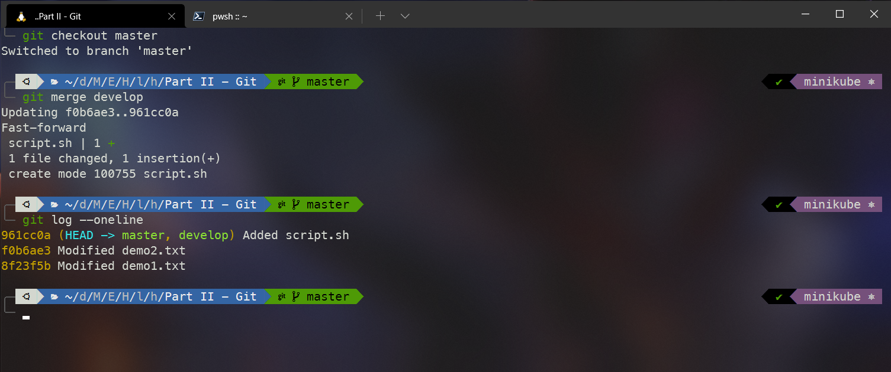
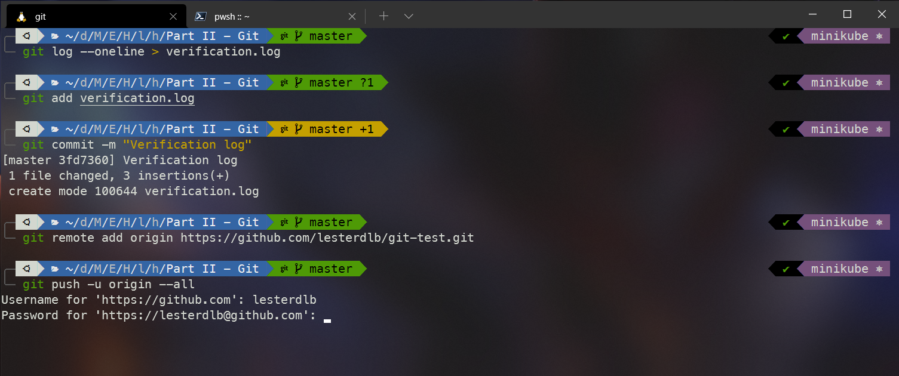

## Parte II: Ejercicios Git

**Nota: El repositorio que contiene los ejercicios es: https://github.com/lesterdlb/git-test**

1. Inicialización de `git`

```
git init --quiet
```

2. Ignorar los ficheros de tipo `.sh`

```
echo "*.sh" > .gitignore
```

3. Crea dos ficheros vacíos: demo1.txt y demo2.txt.

```
touch demo1.txt demo2.txt
git add .
```

4. Modificar el fichero demo1.txt

```
echo "Hola Mundo" >> demo1.txt
git add demo1.txt
git commit -m "Modified demo1.txt"
```



5. Modificar el fichero demo2.txt

```
echo "Hola Mundo demo2" >> demo2.txt
git add demo2.txt
git commit -m "Modified demo3.txt"
```

6. Cambiar el mensaje del commit anterior

```
git commit --amend -m "Modified demo2.txt"
```



7. Creación de la rama `develop`

```
git branch develop && git checkout develop
echo "echo 'Git 101'" > script.sh
```

8. Cambiar permisos al script y agregarlo a la rama `develop`

```
chmod +x script.sh
git add -f script.sh
git commit -m "Added script.sh"
```



9. Merge `develop`

```
git checkout master
git merge develop
```



10. Push to remote repository

```
git log --oneline > verification.log
git add verification.log
git commit -m "Verification log"

git remote add origin https://github.com/lesterdlb/git-test.git
git push -u origin --all
```


